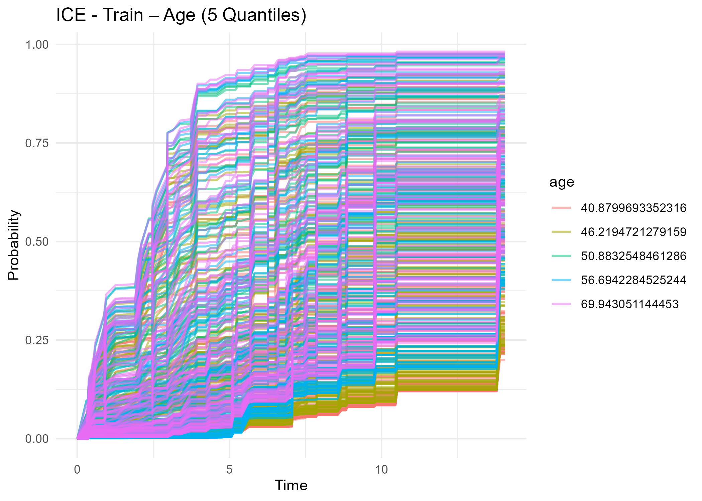
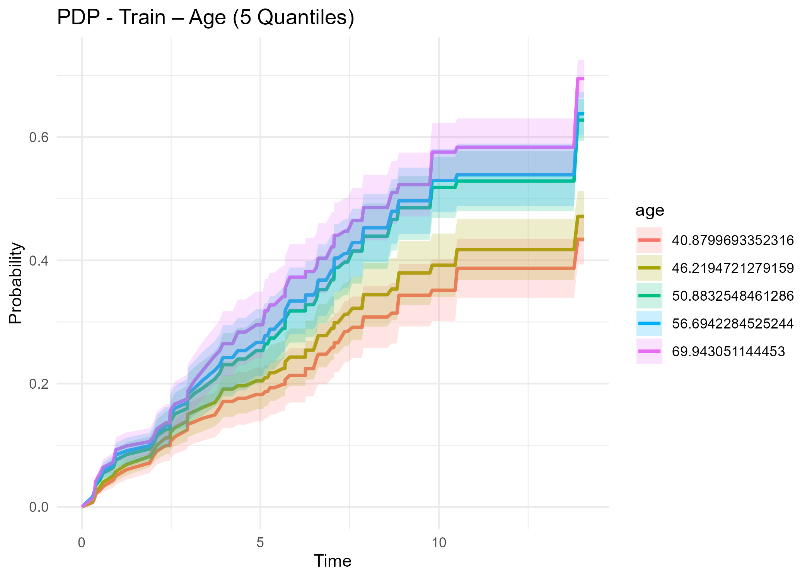
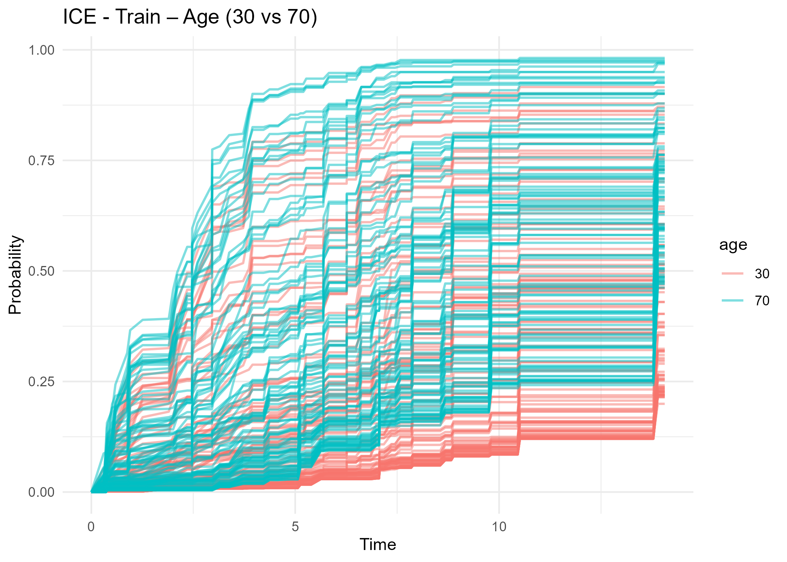
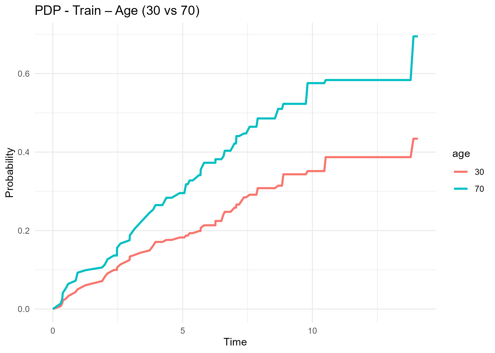
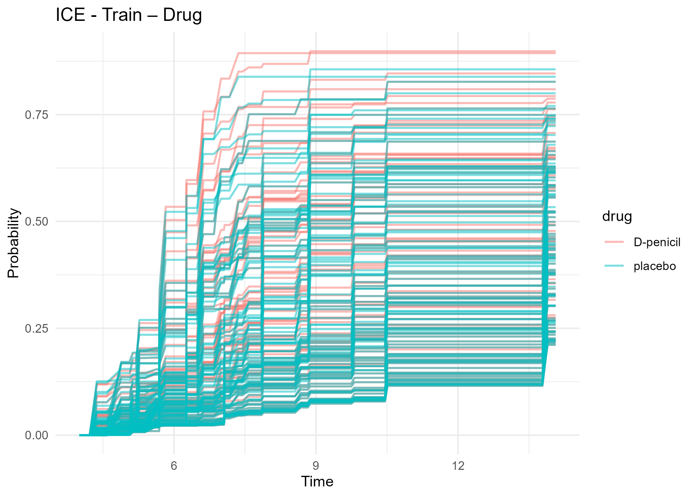
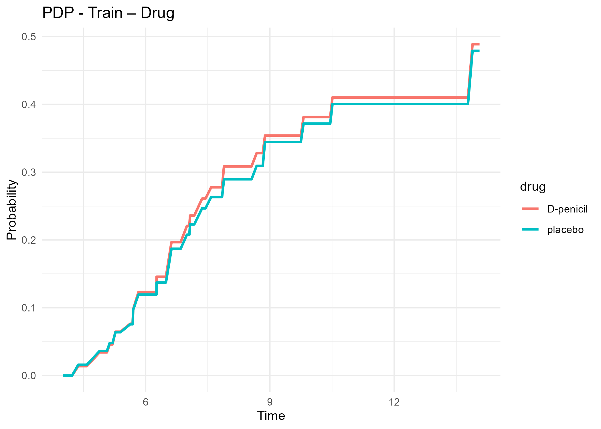
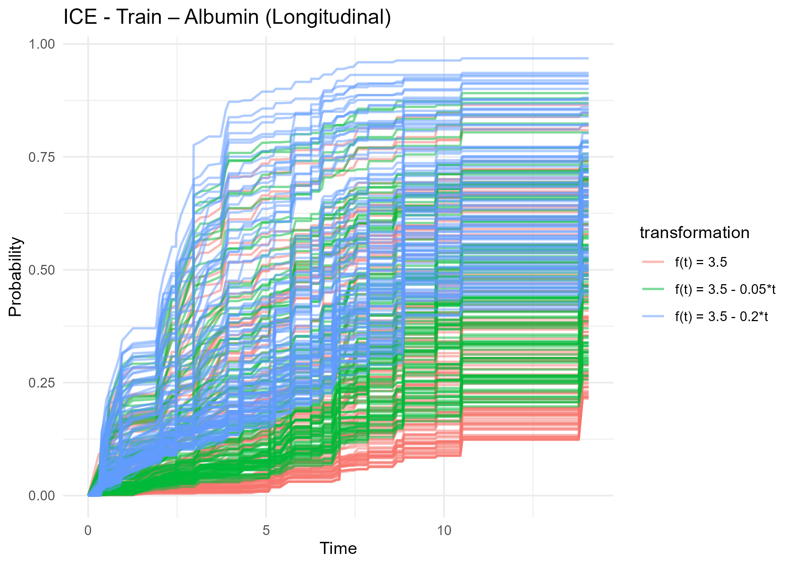
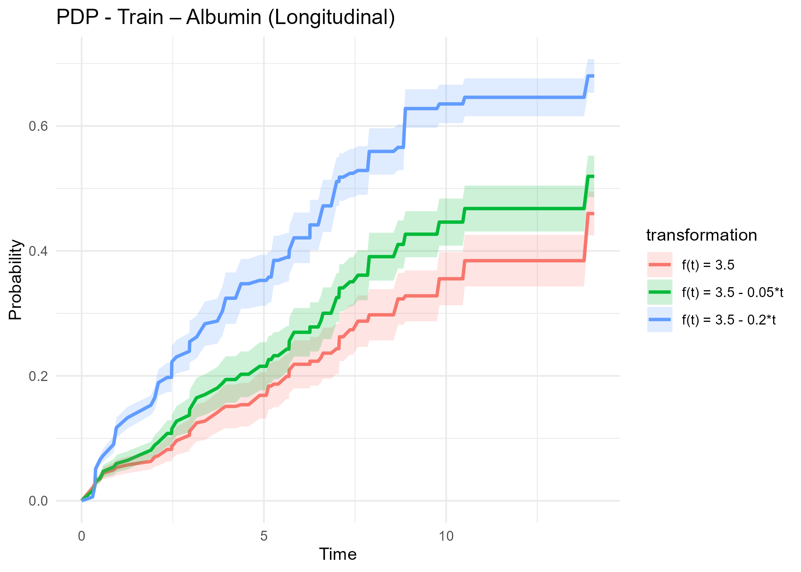
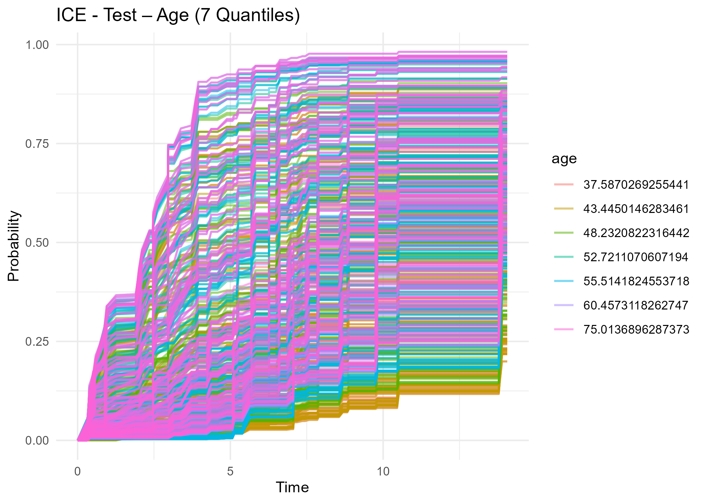
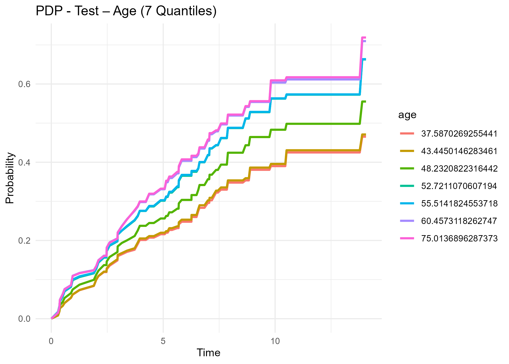

```{r setup, include=FALSE}
knitr::opts_chunk$set(echo = FALSE)
```

```{r packages, message=FALSE, warning = FALSE}
library(ranger)
library(survival)
library(iml)
library(ggplot2)
library(tidyverse)
library(DynForest)
library(pec)
library(risksetROC)
library(tidyr)
library(fda)
library(cluster)
library(survex)
library(fastshap)
library(reshape2)
library(tinytex)
library(viridis)
library(dynr)
library(remotes)
library(RColorBrewer)
library(gridExtra)
library(riskRegression)

```


## 1) Individual Conditional Expectation (ICE)

*Individual Conditional Expectation* (ICE) curves are a tool for local interpretation of machine learning models. Introduced by Goldstein et al., they allow for the visualization of how a given explanatory variable affects a model's prediction for each individual, while holding all other variables constant.

#### Principle

Let $\hat{f}(\cdot)$ be a survival model that predicts a survival or risk function for each individual over time $t$.  
For a given observation $i$, the feature vector is denoted as:  
$\mathbf{x}_i = (\mathbf{x}_{i,A}, \mathbf{x}_{i,-A})$, where:

- $A$ is the index of the variable of interest;  
- $\mathbf{x}_{i,A}$ is the value of this variable for individual $i$;  
- $\mathbf{x}_{i,-A}$ represents the other variables.

The idea of ICE curves is to vary $\mathbf{x}_A$ over a grid of values while keeping $\mathbf{x}_{i,-A}$ constant, and to observe how the prediction $\hat{f}(t \mid \mathbf{x}_A, \mathbf{x}_{i,-A})$ changes over time.

#### Curve Construction

The grid of values for the variable $\mathbf{x}_A$ can be chosen in various ways:

- Equidistant values within the range of the data;  
- Observed values from the sample;  
- Quantiles of the distribution of $\mathbf{x}_A$ (preserving its marginal distribution).

If the variable is binary or categorical, the grid corresponds to its distinct levels.

---

## 2) Partial Dependence Plots (PDP)

*Partial Dependence Plots* (PDPs) are a global interpretation tool that shows the average marginal effect of one or more features on a model’s prediction. Unlike ICE curves, which are specific to each individual, PDPs provide an aggregated view by averaging the individual effects.

#### Principle

Let $\hat{f}(t \mid \mathbf{x})$ be the prediction of a survival model at time $t$.  
To evaluate the effect of a variable $A$, we vary its value over a grid, while keeping all other variables fixed at their observed values.

The partial dependence function is defined as the average of the predictions obtained by replacing variable $A$ with the values from the grid, keeping the rest constant:

\[
f_{\text{PDP},A}(\mathbf{t}^{\text{ord}} \mid \mathbf{x}_A) = \mathbb{E}_{\mathbf{X}_{-A}} \left[ \hat{f}(\mathbf{t}^{\text{ord}} \mid \mathbf{x}_A, \mathbf{X}_{-A}) \right].
\]

#### Empirical Estimation

In practice, we estimate this function using the training sample. For a grid of values $\{x^1_A, \dots, x^g_A\}$, the empirical approximation is:

\[
\hat{f}_{\text{PDP},A}(\mathbf{t}^{\text{ord}} \mid x^k_A) = \frac{1}{n} \sum_{i=1}^n \hat{f}(\mathbf{t}^{\text{ord}} \mid x^k_A, \mathbf{x}^{(i)}_{-A}).
\]

#### Relationship to ICE Curves

PDPs are simply the average of the ICE curves over all individuals:

\[
\hat{f}_{\text{PDP},A}(\mathbf{t}^{\text{ord}} \mid x^k_A) = \frac{1}{n} \sum_{i=1}^n \hat{f}^{\text{ICE}}_i(\mathbf{t}^{\text{ord}} \mid x^k_A).
\]

They help to detect average trends, while ICE curves reveal individual heterogeneity or potential interactions.


# Description

The `compute_ice_pdp()` function is designed to compute data necessary for generating ICE (Individual Conditional Expectation) and PDP (Partial Dependence Plot) curves for a given variable in a dynamic prediction model built with `dynforest`.  
It works with fixed covariates (e.g., baseline characteristics), categorical or continuous variables, as well as longitudinal (time-dependent) variables.

# Usage

```r
compute_ice_pdp(
  timeData = NULL,
  fixedData = NULL,
  model,
  var_name,
  var_type,
  values = NULL,
  timeVar = NULL,
  idVar = NULL,
  t0 = NULL
)

```
## Arguments

### `timeData` *(optional)*  
A data frame containing longitudinal data (time-varying covariates).  
Required when `var_name` refers to a longitudinal variable or when the model includes longitudinal predictors.  
If not provided, the function will try to reconstruct it from the model’s training data if available.

### `fixedData` *(optional)*   
A data frame containing baseline (fixed) covariates.  
Each row corresponds to an individual.  
If not provided, the function attempts to reconstruct it from the factor and numeric parts of the model’s training data.

### `model`  
A fitted `dynforest` model object.  
Used to generate predictions for each individual.

### `var_name`  
A character string specifying the name of the variable of interest.  
This is the feature for which ICE/PDP effects will be estimated.

### `var_type`  
The type of the variable. Must be one of:  
- `"numeric"`: continuous scalar variable  
- `"categorical"`: factor or categorical variable  
- `"longitudinal"`: time-dependent variable

### `values` *(optional)*  
Controls the tested values for the variable of interest. Its interpretation depends on `var_type`:

- For **numeric variables**:  
  - If omitted, defaults to 5 quantiles of the variable.  
  - If a single integer is provided, interpreted as the number of quantiles to compute.  
  - Otherwise, a numeric vector of values to test.  

- For **categorical variables**:  
  - If omitted, all observed levels in the data are tested.  
  - Otherwise, a vector of factor levels to test.  

- For **longitudinal variables**:  
  - **Mandatory**: a named list of functions.  
  - Each function defines a hypothetical time trajectory and must accept a vector of time points returning corresponding values (to simulate the variable over time).

### `timeVar` *(optional)*  
The name of the time column in `timeData`.  
Required for longitudinal variables. Indicates the measurement times.  
If not provided, attempts to auto-detect or defaults to `"time"`.

### `idVar`  *(optional)*  
The name of the column indicating the individual ID in both `fixedData` and `timeData`.  
If not provided, attempts to auto-detect from the model’s training data.

### `t0` *(optional)*  
A landmark time used for computing dynamic predictions, if applicable.

---

### Value

Returns a `data.frame` in long format containing the results needed for ICE/PDP plotting.  
The output includes:

- **`time`**: time points at which predictions are computed.  
- **`value`**: predicted probabilities (e.g., cumulative incidence function).  
- **`replicate_id`**: index of the tested value or trajectory.  
- **`id`**: individual identifier.  
- **`transformation`** *(only for longitudinal variables)*: label of the function used to generate the simulated trajectory.  
- The tested value of `var_name` *(for numeric or categorical variables)*.

This output can be directly passed to the plotting function plot to visualize ICE and PDP curves.


# Plotting ICE & PDP results

Once the output of `compute_ice_pdp()` is obtained, it can be visualized using the `plot()` method.  
This method dispatches to `plot.dynforestpdp()` and supports both ICE and PDP plots.


# Usage

```r
plot(
  x,
  x_label = NULL,
  y_label = "Probability",
  title = "ICE and PDP Plot",
  conf_band = FALSE,
  alpha = 0.2,
  type = c("both", "ice", "pdp"),
  ...
)

```

## Arguments

### `x`  
  A `dynforestpdp` object returned by `compute_ice_pdp()`.

### `x_label` *(optional)*  
  Label for the x-axis (typically time).

### `y_label` *(optional, default = `"Probability"`)*  
  Label for the y-axis.

### `title` *(optional)*  
  Main title for the plot(s).

### `conf_band` *(logical, default = `FALSE`)*  
  Whether to display confidence bands on the PDP curve (based on normal approximation).

### `alpha` *(numeric, default = `0.2`)*  
  Opacity level for confidence bands (only used if `conf_band = TRUE`).

### `type` *(character)*  
  Controls which plot(s) to generate. Options:  
  - `"both"` (default): plots both ICE and PDP  
  - `"ice"`: only the individual ICE curves  
  - `"pdp"`: only the PDP curve with mean predictions (and optional confidence bands)

### `...`
  Additional arguments passed to the underlying `ggplot2` functions (not commonly needed).


```{r training a dynforest model on pbc2 with timedata and fixeddata, include = FALSE }
# Load required dataset
data("pbc2")
set.seed(1234)

# Sample training set (100 individuals)
train_ids <- sample(unique(pbc2$id), 100)
pbc2_train <- subset(pbc2, id %in% train_ids)

# Training data
fixedData_train <- unique(pbc2_train[, c("id", "age", "drug", "sex")])
timeData_train  <- pbc2_train[, c("id", "time", "serBilir", "SGOT", "albumin", "alkaline")]
Y <- list(
  type = "surv",
  Y = unique(pbc2_train[, c("id", "years", "event")])
)

# Longitudinal models
timeVarModel <- list(
  serBilir = list(fixed = serBilir ~ time, random = ~ time),
  SGOT     = list(fixed = SGOT ~ time + I(time^2), random = ~ time + I(time^2)),
  albumin  = list(fixed = albumin ~ time, random = ~ time),
  alkaline = list(fixed = alkaline ~ time, random = ~ time)
)

# Train or load dynforest model
if (!file.exists("res_dyn_model.RData")) {
  res_dyn <- dynforest(
    timeData = timeData_train,
    fixedData = fixedData_train,
    timeVar = "time",
    idVar = "id",
    timeVarModel = timeVarModel,
    Y = Y,
    ntree = 50,
    nodesize = 5,
    minsplit = 5,
    cause = 2,
    ncores = 2,
    seed = 1234
  )
  save(res_dyn, file = "res_dyn_model.RData")
} else {
  load("res_dyn_model.RData")
  cat("res_dyn_model.RData already exists. Loaded the pre-trained model.\n")
}

# Create test set (100 individuals not in training)
set.seed(5678)
test_ids <- setdiff(unique(pbc2$id), train_ids)
pbc2_test <- subset(pbc2, id %in% sample(test_ids, 100))

# Test data
fixedData_test <- unique(pbc2_test[, c("id", "age", "drug", "sex")])
timeData_test  <- pbc2_test[, c("id", "time", "serBilir", "SGOT", "albumin", "alkaline")]

```


# Examples

The examples below were conducted using the `pbc2` dataset. A `dynforest` model was trained on a randomly selected sample of **100 patients**. The model included:

- **Longitudinal predictors**: `serBilir`, `SGOT`, `albumin`, `alkaline`  
- **Baseline (fixed) covariates**: `age`, `drug`, `sex`  
- **Number of trees**: **50**  
- **Survival outcome**: competing risks with `cause = 2` (death before transplantation)  

We illustrate two types of use cases:

---

### Training data

When using `compute_ice_pdp()` on the **training sample**, the relevant data  
(`fixedData`, `timeData`, `idVar`, `timeVar`) are internally **reconstructed** from the fitted `dynforest` model object.

Therefore, you only need to specify:

- `model`  
- `var_name`  
- `var_type`  
- `values` *(optional, depending on `var_type` — see documentation)*

---

### Test data

When applying the function to **new data** (here, another sample of **100 patients not included** in the training set),  
the following arguments must be **explicitly** provided:

- `fixedData`: data frame of baseline covariates  
- `timeData`: data frame of longitudinal measurements  
- `idVar`: column name identifying individuals  
- `timeVar`: column name for measurement times  
- `model`, `var_name`, `var_type`, `values`: as usual

> ⚠️ **Note:** Specifying `idVar` and `timeVar` is only necessary if the new dataset uses different column names than the ones used in the training data.  
> If the column names are the same, these arguments will be inferred automatically from the trained model.

```{r ice-pdp-plots, warning=FALSE, message=FALSE, include=FALSE}
save_ice_pdp_plots <- function(base_filename, expr_res, x_label = NULL, title = NULL, conf_band = TRUE) {
  # Create output directory if it does not exist
  dir.create("plots_ice_pdp", showWarnings = FALSE)

  # Define file paths for ICE and PDP plots
  fname_ice <- file.path("plots_ice_pdp", paste0(base_filename, "_ICE.png"))
  fname_pdp <- file.path("plots_ice_pdp", paste0(base_filename, "_PDP.png"))

  # Evaluate and generate plots only if they do not already exist
  if (!file.exists(fname_ice) || !file.exists(fname_pdp)) {
    res <- eval(expr_res)

    if (!file.exists(fname_ice)) {
      p_ice <- plot(res, x_label = x_label, title = title, conf_band = conf_band, type = "ice")
      ggsave(fname_ice, p_ice, width = 7, height = 5)
      message("ICE plot saved to: ", fname_ice)
    } else {
      message("ICE plot already exists: ", fname_ice)
    }

    if (!file.exists(fname_pdp)) {
      p_pdp <- plot(res, x_label = x_label, title = title, conf_band = conf_band, type = "pdp")
      ggsave(fname_pdp, p_pdp, width = 7, height = 5)
      message("PDP plot saved to: ", fname_pdp)
    } else {
      message("PDP plot already exists: ", fname_pdp)
    }

  } else {
    message("ICE and PDP plots already exist for: ", base_filename)
  }
}
```

```{r compute and save ICE and PDP for the examples, message=FALSE}

# Compute and save ICE & PDP for the training sample

# Longitudinal variable (albumin)
save_ice_pdp_plots("albumin_longitudinal_train", quote({
  funcs <- list(
    "f(t) = 3.5"           = function(t) rep(3.5, length(t)),
    "f(t) = 3.5 - 0.05*t"  = function(t) 3.5 - 0.05 * t,
    "f(t) = 3.5 - 0.2*t"   = function(t) 3.5 - 0.2 * t
  )
  compute_ice_pdp(
    model = res_dyn,
    var_name = "albumin",
    values = funcs
  )
}), x_label = "Time", title = "Train – Albumin (Longitudinal)", conf_band = TRUE)


# Numeric variable (age) – 5 quantiles
save_ice_pdp_plots("age_train_quantiles", quote({
  compute_ice_pdp(
    model = res_dyn,
    var_name = "age",
  )
}), x_label = "Time", title = "Train – Age (5 Quantiles)", conf_band = TRUE)


# Numeric variable (age) – 30 vs 70
save_ice_pdp_plots("age_train_30_70", quote({
  compute_ice_pdp(
    model = res_dyn,
    var_name = "age",
    values = c(30, 70)
  )
}), x_label = "Time", title = "Train – Age (30 vs 70)", conf_band = FALSE)


# Categorical variable (sex)
save_ice_pdp_plots("sex_train", quote({
  compute_ice_pdp(
    model = res_dyn,
    var_name = "sex",
  )
}), x_label = "Time", title = "Train – Sex", conf_band = FALSE)


# Categorical variable (drug)
save_ice_pdp_plots("drug_train", quote({
  compute_ice_pdp(
    model = res_dyn,
    var_name = "drug",
    t0 = 4
  )
}), x_label = "Time", title = "Train – Drug", conf_band = FALSE)


# Longitudinal variable (serBilir)
save_ice_pdp_plots("serBilir_longitudinal_train", quote({
  funcs <- list(
    "f(t) = 3"         = function(t) rep(3, length(t)),
    "f(t) = 3 + 0.5*t" = function(t) 3 + 0.5 * t,
    "f(t) = 3 + 3*t"   = function(t) 3 + 3 * t
  )
  compute_ice_pdp(
    model = res_dyn,
    var_name = "serBilir",
    values = funcs
  )
}), x_label = "Time", title = "Train – serBilir (Longitudinal)", conf_band = TRUE)

```

```{r compute and save ice for the test dataset, message=FALSE}
# Compute and save ICE & PDP for the test sample

# Longitudinal variable (albumin)
save_ice_pdp_plots("albumin_longitudinal_test", quote({
  funcs <- list(
    "f(t) = 3.5"           = function(t) rep(3.5, length(t)),
    "f(t) = 3.5 - 0.05*t"  = function(t) 3.5 - 0.05 * t,
    "f(t) = 3.5 - 0.2*t"   = function(t) 3.5 - 0.2 * t
  )
  compute_ice_pdp(
    timeData = timeData_test,
    fixedData = fixedData_test,
    model = res_dyn,
    var_name = "albumin",
    values = funcs,
    idVar = "id",
    timeVar = "time"
  )
}), x_label = "Time", title = "Test – Albumin (Longitudinal)", conf_band = TRUE)


# Numeric variable (age) – 7 quantiles
save_ice_pdp_plots("age_test_7quantiles", quote({
  compute_ice_pdp(
    timeData = timeData_test,
    fixedData = fixedData_test,
    model = res_dyn,
    var_name = "age",
    values = 7
  )
}), x_label = "Time", title = "Test – Age (7 Quantiles)", conf_band = FALSE)


# Numeric variable (age) – 30 vs 70
save_ice_pdp_plots("age_test_30_70", quote({
  compute_ice_pdp(
    timeData = timeData_test,
    fixedData = fixedData_test,
    model = res_dyn,
    var_name = "age",
    values = c(30, 70),
    idVar = "id",
    timeVar = "time"
  )
}), x_label = "Time", title = "Test – Age (30 vs 70)", conf_band = FALSE)


# Categorical variable (sex)
save_ice_pdp_plots("sex_test", quote({
  compute_ice_pdp(
    timeData = timeData_test,
    fixedData = fixedData_test,
    model = res_dyn,
    var_name = "sex",
    idVar = "id",
    timeVar = "time"
  )
}), x_label = "Time", title = "Test – Sex", conf_band = FALSE)


# Categorical variable (drug)
save_ice_pdp_plots("drug_test", quote({
  compute_ice_pdp(
    timeData = timeData_test,
    fixedData = fixedData_test,
    model = res_dyn,
    var_name = "drug",
    idVar = "id",
    timeVar = "time",
    t0 = 4
  )
}), x_label = "Time", title = "Test – Drug", conf_band = FALSE)


# Longitudinal variable (serBilir)
save_ice_pdp_plots("serBilir_longitudinal_test", quote({
  funcs <- list(
    "f(t) = 3"         = function(t) rep(3, length(t)),
    "f(t) = 3 + 0.5*t" = function(t) 3 + 0.5 * t,
    "f(t) = 3 + 3*t"   = function(t) 3 + 3 * t
  )
  compute_ice_pdp(
    timeData = timeData_test,
    fixedData = fixedData_test,
    model = res_dyn,
    var_name = "serBilir",
    values = funcs,
    idVar = "id",
    timeVar = "time"
  )
}), x_label = "Time", title = "Test – serBilir (Longitudinal)", conf_band = TRUE)

```


## Examples on the train dataset

### Numerical predictor : Age (5 quantiles and 30 VS 70) 

```r 
res_age_quantiles_train <- compute_ice_pdp(
  model = res_dyn,
  var_name = "age",
)
plot(res_age_quantiles_train, x_label = "Time", title = "Age (5 Quantiles) – Train", conf_band = TRUE)

```

```{r, echo=FALSE, fig.show='hold', out.width='49%'}



```


```r 
res_age_30_70_train <- compute_ice_pdp(
  model = res_dyn,
  var_name = "age",
  values = c(30, 70)
)
plot(res_age_30_70_train, x_label = "Time", title = "Age 30 vs 70 – Train", conf_band = FALSE)

```

```{r, echo=FALSE, fig.show='hold', out.width='49%', message=FALSE}



```


### Categorical predictor : Drug

```r 
res_drug_train <- compute_ice_pdp(
  model = res_dyn,
  var_name = "drug",
  t0 = 4
)
plot(res_drug_train, x_label = "Time", title = "Drug – Train", conf_band = FALSE)

```

```{r, echo=FALSE, fig.show='hold', out.width='49%' }



```


### Longitudinal predictor : Albumin

```{r, echo = FALSE}

set.seed(123)
sample_ids <- sample(unique(timeData_train$id), 20)
subset_data <- timeData_train[timeData_train$id %in% sample_ids, ]
subset_data$id <- as.factor(subset_data$id)
f1 <- function(t) rep(3.5, length(t))
f2 <- function(t) 3.5 - 0.05 * t
f3 <- function(t) 3.5 - 0.2 * t
time_seq <- seq(min(subset_data$time), max(subset_data$time), length.out = 100)
func_df <- data.frame(
  time = rep(time_seq, 3),
  value = c(f1(time_seq), f2(time_seq), f3(time_seq)),
  Function = factor(rep(c("f(t) = 3.5", "f(t) = 3.5 - 0.05*t", "f(t) = 3.5 - 0.2*t"), each = length(time_seq)))
)

ggplot() +
  geom_line(data = subset_data, aes(x = time, y = albumin, group = id),
            color = "steelblue", linewidth = 0.8, alpha = 0.5) +
  geom_line(data = func_df, aes(x = time, y = value, color = Function),
            linewidth = 1.2) +
  scale_color_brewer(palette = "Set1") +
  labs(
    title = "Albumin trajectories for 20 patients with overlaid functions",
    x = "Time", y = "Albumin", color = "Function"
  ) +
  theme_minimal() +
  theme(legend.position = "right")

```


```r 
f1 <- function(t) rep(3.5, length(t))
f2 <- function(t) 3.5 - 0.05 * t
f3 <- function(t) 3.5 - 0.2 * t
funcs <- list("f(t) = 3.5" = f1, "f(t) = 3.5 - 0.05*t" = f2, "f(t) = 3.5 - 0.2*t" = f3)

res_albumin_train <- compute_ice_pdp(
  model = res_dyn,
  var_name = "albumin",
)
plot(res_albumin_train, x_label = "Time", title = "Albumin – Longitudinal model", conf_band = TRUE, type = "both")

```

```{r albumin_longitudinal_train_plots, echo=FALSE, fig.show='hold', out.width='49%'}



```


## Example on the test dataset 


```r 
res_age_7quantiles_test <- compute_ice_pdp(
  timeData = timeData_test,
  fixedData = fixedData_test,
  model = res_dyn,
  var_name = "age",
  values = 7
)
plot(res_age_7quantiles_test, x_label = "Time", title = "Age (7 Quantiles) – Test", conf_band = FALSE)
```

```{r , echo=FALSE, fig.show='hold', out.width='49%'}



```


