```{r setup, include=FALSE}
knitr::opts_chunk$set(echo = FALSE)
```

```{r packages, message=FALSE, include=FALSE}
library(ranger)
library(survival)
library(iml)
library(ggplot2)
library(tidyverse)
library(DynForest)
library(pec)
library(risksetROC)
library(tidyr)
library(fda)
library(cluster)
library(survex)
library(fastshap)
library(reshape2)
library(tinytex)
library(viridis)
library(dynr)
library(remotes)
library(RColorBrewer)
library(gridExtra)
library(riskRegression)

```


## 1) Individual Conditional Expectation (ICE)

*Individual Conditional Expectation* (ICE) curves are a tool for local interpretation of machine learning models. Introduced by Goldstein et al., they allow for the visualization of how a given explanatory variable affects a model's prediction for each individual, while holding all other variables constant.

#### Principle

Let $\hat{f}(\cdot)$ be a survival model that predicts a survival or risk function for each individual over time $t$.  
For a given observation $i$, the feature vector is denoted as:  
$\mathbf{x}_i = (\mathbf{x}_{i,A}, \mathbf{x}_{i,-A})$, where:

- $A$ is the index of the variable of interest;  
- $\mathbf{x}_{i,A}$ is the value of this variable for individual $i$;  
- $\mathbf{x}_{i,-A}$ represents the other variables.

The idea of ICE curves is to vary $\mathbf{x}_A$ over a grid of values while keeping $\mathbf{x}_{i,-A}$ constant, and to observe how the prediction $\hat{f}(t \mid \mathbf{x}_A, \mathbf{x}_{i,-A})$ changes over time.

#### Curve Construction

The grid of values for the variable $\mathbf{x}_A$ can be chosen in various ways:

- Equidistant values within the range of the data;  
- Observed values from the sample;  
- Quantiles of the distribution of $\mathbf{x}_A$ (preserving its marginal distribution).

If the variable is binary or categorical, the grid corresponds to its distinct levels.

---

## 2) Partial Dependence Plots (PDP)

*Partial Dependence Plots* (PDPs) are a global interpretation tool that shows the average marginal effect of one or more features on a model’s prediction. Unlike ICE curves, which are specific to each individual, PDPs provide an aggregated view by averaging the individual effects.

#### Principle

Let $\hat{f}(t \mid \mathbf{x})$ be the prediction of a survival model at time $t$.  
To evaluate the effect of a variable $A$, we vary its value over a grid, while keeping all other variables fixed at their observed values.

The partial dependence function is defined as the average of the predictions obtained by replacing variable $A$ with the values from the grid, keeping the rest constant:

\[
f_{\text{PDP},A}(\mathbf{t}^{\text{ord}} \mid \mathbf{x}_A) = \mathbb{E}_{\mathbf{X}_{-A}} \left[ \hat{f}(\mathbf{t}^{\text{ord}} \mid \mathbf{x}_A, \mathbf{X}_{-A}) \right].
\]

#### Empirical Estimation

In practice, we estimate this function using the training sample. For a grid of values $\{x^1_A, \dots, x^g_A\}$, the empirical approximation is:

\[
\hat{f}_{\text{PDP},A}(\mathbf{t}^{\text{ord}} \mid x^k_A) = \frac{1}{n} \sum_{i=1}^n \hat{f}(\mathbf{t}^{\text{ord}} \mid x^k_A, \mathbf{x}^{(i)}_{-A}).
\]

#### Relationship to ICE Curves

PDPs are simply the average of the ICE curves over all individuals:

\[
\hat{f}_{\text{PDP},A}(\mathbf{t}^{\text{ord}} \mid x^k_A) = \frac{1}{n} \sum_{i=1}^n \hat{f}^{\text{ICE}}_i(\mathbf{t}^{\text{ord}} \mid x^k_A).
\]

They help to detect average trends, while ICE curves reveal individual heterogeneity or potential interactions.


# Description

The `compute_ice_pdp()` function is designed to compute data necessary for generating ICE (Individual Conditional Expectation) and PDP (Partial Dependence Plot) curves for a given variable in a dynamic prediction model built with `dynforest`.  
It works with fixed covariates (e.g., baseline characteristics), categorical or continuous variables, as well as longitudinal (time-dependent) variables.

# Usage

```r
compute_ice_pdp <- function(timeData = NULL, fixedData = NULL, model, var_name,
                            values = NULL, timeVar = NULL, idVar = NULL, t0 = NULL,
                            target_class = NULL,
                            grid_type = c("regular", "observed", "quantile"),
                            grid_size = 50,
                            ncores = 1)
```

# Arguments

**`timeData`** *(optional)*  
A data frame containing the ID variable, the time variable, and all time-varying covariates.  
If `NULL`, the function attempts to reconstruct it automatically from `model$data$Longitudinal`.

**`fixedData`** *(optional)*  
A data frame containing baseline (fixed) covariates and the ID column.  
If `NULL`, reconstructed from `model$data$Numeric` and `model$data$Factor`.

**`model`**  
A fitted `dynforest` model object.

**`var_name`**  
A character string giving the name of the variable for which ICE/PDP should be computed.  
Can be numeric, categorical, or longitudinal.

**`values`** *(optional)*  
Specifies the values or transformations to test for the variable of interest.  
Interpretation depends on the variable type:

- **Numeric**  
  - If omitted: defaults to 5 quantiles of the variable.  
  - If a single integer: interpreted as the number of quantiles to compute.  
  - If a numeric vector: directly used as testing values.  

- **Categorical**  
  - A vector of factor levels to evaluate.  
  - Defaults to all observed levels.  

- **Longitudinal**  
  - A **named list of functions**, each generating a transformed trajectory.  
  - Each function receives a vector of time points and returns corresponding values.

**`timeVar`** *(optional)*  
Name of the time column in `timeData`.  
If `NULL`, detected from `model$timeVar` or defaults to `"time"`.

**`idVar`** *(optional)*  
Name of the subject identifier column.  
If `NULL`, the function attempts to detect it from the model’s stored data.

**`t0`** *(optional)*  
Landmark time for dynamic prediction.  
If `NULL`, predictions use all available information from time 0.

**`target_class`** *(optional)*  
For classification models, selects the class for which ICE/PDP is computed.  
If `NULL`, the function may return results for all classes.

**`grid_type`** *(optional)*  
Type of grid used to generate numeric testing values when `values` is not provided.  
Options include `"regular"`, `"quantile"`, or `"observed"`.

**`grid_size`** *(optional)*  
Number of points in the grid when generating numeric values (used when `grid_type` requires it).

**`ncores`** *(optional)*  
Number of CPU cores to use for parallel computations.  
Defaults to 1.


# Value

Returns a `data.frame` in long format containing the results needed for ICE/PDP plotting.  
The output includes:

- **`time`** *(only for a survival forest)*: time points at which predictions are computed  
- **`value`**: predicted probabilities (e.g., CIF) or values 
- **`replicate_id`**: index of the value or trajectory tested  
- **`id`**: individual identifier  
- **`target class`** *(only for a classification model)*: the class at which predicted probability are computed 
- **`transformation`** *(only for longitudinal variables)*: label of the function used for the simulated trajectory  
- The tested value of `var_name` *(for numeric or categorical variables)*

This output can be directly passed to a plotting function (e.g., `plot.dynforestpdp`) to visualize ICE and PDP curves.


```{r models, include = FALSE }

set.seed(1234)

# Utility function to load existing model or train new one
load_or_train <- function(filename, train_func) {
  if (file.exists(filename)) {
    message(paste("Loading existing model:", filename))
    readRDS(filename)
  } else {
    message(paste("Training new model:", filename))
    model <- train_func()
    saveRDS(model, file = filename)
    model
  }
}

# ============================================================
# 1. Survival model (pbc2 dataset)
# ============================================================
data(pbc2)

# Split IDs for train/test
all_ids <- unique(pbc2$id)
train_ids <- sample(all_ids, length(all_ids) * 2/3)
test_ids  <- setdiff(all_ids, train_ids)

# Training data
pbc2_train <- pbc2 %>% filter(id %in% train_ids)
timeData_train <- pbc2_train[, c("id", "time", "serBilir", "SGOT", "albumin", "alkaline")]
fixedData_train <- unique(pbc2_train[, c("id", "age", "drug", "sex")])

# Test data
pbc2_test <- pbc2 %>% filter(id %in% test_ids)
timeData_test <- pbc2_test[, c("id", "time", "serBilir", "SGOT", "albumin", "alkaline")]
fixedData_test <- unique(pbc2_test[, c("id", "age", "drug", "sex")])

# Longitudinal variable models
timeVarModel_surv <- list(
  serBilir = list(fixed = serBilir ~ time, random = ~ time),
  SGOT     = list(fixed = SGOT ~ time + I(time^2), random = ~ time + I(time^2)),
  albumin  = list(fixed = albumin ~ time, random = ~ time),
  alkaline = list(fixed = alkaline ~ time, random = ~ time)
)

# Outcome
Y_surv <- list(type = "surv", Y = unique(pbc2_train[, c("id", "years", "event")]))

# Train/load model
res_surv <- load_or_train("res_surv.rds", function() {
  dynforest(
    timeData = timeData_train,
    fixedData = fixedData_train,
    timeVar = "time", idVar = "id",
    timeVarModel = timeVarModel_surv,
    Y = Y_surv,
    ntree = 50, nodesize = 2, minsplit = 3,
    cause = 2, ncores = 7, seed = 1234
  )
})

# ============================================================
# 2. Numeric model (simulated data)
# ============================================================
data(data_simu1)

# Longitudinal data
timeData_num <- data_simu1[, c("id", "time", paste0("marker", 1:6))]
timeVarModel_num <- setNames(
  lapply(paste0("marker", 1:6), function(x) {
    list(fixed = reformulate(termlabels = "time", response = x), random = ~ time)
  }),
  paste0("marker", 1:6)
)

# Fixed covariates
fixedData_num <- unique(data_simu1[, c("id", "cont_covar1", "cont_covar2", "bin_covar1", "bin_covar2")])

# Outcome
Y_num <- list(type = "numeric", Y = unique(data_simu1[, c("id", "Y_res")]))

# Train/load model
res_num <- load_or_train("res_num.rds", function() {
  dynforest(
    timeData = timeData_num,
    fixedData = fixedData_num,
    timeVar = "time", idVar = "id",
    timeVarModel = timeVarModel_num,
    Y = Y_num,
    ncores = 7, seed = 1234, ntree = 50
  )
})

# ============================================================
# 3. Categorical model (based on pbc2)
# ============================================================
# Training data
pbc2_cat_train <- pbc2 %>% filter(id %in% train_ids)
timeData_cat <- pbc2_cat_train[, c("id", "time", "serBilir", "SGOT", "albumin", "alkaline")]
fixedData_cat <- unique(pbc2_cat_train[, c("id", "age", "drug", "sex")])

# Longitudinal variable models
timeVarModel_cat <- list(
  serBilir = list(fixed = serBilir ~ time, random = ~ time),
  SGOT     = list(fixed = SGOT ~ time + I(time^2), random = ~ time + I(time^2)),
  albumin  = list(fixed = albumin ~ time, random = ~ time),
  alkaline = list(fixed = alkaline ~ time, random = ~ time)
)

# Outcome
Y_cat <- unique(pbc2_cat_train[, c("id", "event")])
Y_cat$event <- factor(Y_cat$event, levels = c(0, 1, 2))
Y_cat_list <- list(type = "factor", Y = Y_cat)

# Train/load model
res_cat <- load_or_train("res_cat.rds", function() {
  dynforest(
    timeData = timeData_cat,
    fixedData = fixedData_cat,
    timeVar = "time", idVar = "id",
    timeVarModel = timeVarModel_cat,
    Y = Y_cat_list,
    ncores = 7, seed = 1234, ntree = 50
  )
})


```


# Examples

The examples shown above were performed on three DynForest models using longitudinal data: a survival forest trained on the pbc2 dataset to predict mortality, a classification forest also trained on pbc2, and a regression forest trained on a simulated dataset.


```{r tests}
# ============================================================
# GENERAL PARAMETERS
# ============================================================
grid_size    <- 20
ncores       <- 20
target_class <- "2"
grid_types   <- c("regular", "observed", "quantile")

# ============================================================
# UTILITY FUNCTIONS
# ============================================================
compute_save <- function(filename, expr) {
  if (file.exists(filename)) {
    readRDS(filename)
  } else {
    result <- eval(expr)
    saveRDS(result, file = filename)
    result
  }
}

# Example: survival test comparing age 30 vs 70
age_test_values <- c(30, 70)

# ============================================================
# SURVIVAL MODEL
# ============================================================
res_surv_age_test <- compute_save("res_surv_age_test_pdp.rds", quote(
  compute_ice_pdp(
    model     = res_surv,
    var_name  = "age",
    values    = age_test_values,
    timeData  = timeData_test,
    fixedData = fixedData_test,
    timeVar   = "time",
    idVar     = "id",
    ncores    = ncores
  )
))

res_surv_drug <- compute_save("res_surv_drug_pdp.rds", quote(
  compute_ice_pdp(
    model     = res_surv,
    var_name  = "drug",
    timeData  = timeData_test,
    fixedData = fixedData_test,
    timeVar   = "time",
    idVar     = "id",
    ncores    = ncores
  )
))

serBilir_funcs <- list(
  slow   = function(x) { 3 + (x - x[1]) * 0.5 },
  medium = function(x) { 3 + (x - x[1]) * 1.0 },
  fast   = function(x) { 3 + (x - x[1]) * 2.0 }
)

res_surv_serBilir <- compute_save("res_surv_serBilir_pdp.rds", quote(
  compute_ice_pdp(
    model     = res_surv,
    var_name  = "serBilir",
    values    = serBilir_funcs,
    timeData  = timeData_test,
    fixedData = fixedData_test,
    timeVar   = "time",
    idVar     = "id",
    ncores    = ncores
  )
))

# ============================================================
# GENERAL PARAMETERS
# ============================================================
grid_size    <- 20
ncores       <- 20
target_class <- "2"
grid_types   <- c("regular", "observed", "quantile")

# ============================================================
# UTILITY FUNCTION
# ============================================================
compute_save <- function(filename, expr) {
  if (file.exists(filename)) {
    readRDS(filename)
  } else {
    result <- expr
    saveRDS(result, file = filename)
    result
  }
}

# Example: survival test comparing age 30 vs 70
age_test_values <- c(30, 70)

# ============================================================
# SURVIVAL MODEL
# ============================================================
res_surv_age_test <- compute_save("res_surv_age_test_pdp.rds", 
  compute_ice_pdp(
    model     = res_surv,
    var_name  = "age",
    values    = age_test_values,
    timeData  = timeData_test,
    fixedData = fixedData_test,
    timeVar   = "time",
    idVar     = "id",
    ncores    = ncores
  )
)

res_surv_drug <- compute_save("res_surv_drug_pdp.rds", 
  compute_ice_pdp(
    model     = res_surv,
    var_name  = "drug",
    timeData  = timeData_test,
    fixedData = fixedData_test,
    timeVar   = "time",
    idVar     = "id",
    ncores    = ncores
  )
)

serBilir_funcs <- list(
  slow   = function(x) { 3 + (x - x[1]) * 0.5 },
  medium = function(x) { 3 + (x - x[1]) * 1.0 },
  fast   = function(x) { 3 + (x - x[1]) * 2.0 }
)

res_surv_serBilir <- compute_save("res_surv_serBilir_pdp.rds", 
  compute_ice_pdp(
    model     = res_surv,
    var_name  = "serBilir",
    values    = serBilir_funcs,
    timeData  = timeData_test,
    fixedData = fixedData_test,
    timeVar   = "time",
    idVar     = "id",
    ncores    = ncores
  )
)

# ============================================================
# NUMERIC MODEL
# ============================================================
res_num_cont1_list <- lapply(grid_types, function(gt) {
  compute_save(paste0("res_num_cont1_", gt, "_pdp.rds"), 
    compute_ice_pdp(
      model     = res_num,
      var_name  = "cont_covar1",
      grid_type = gt,
      grid_size = grid_size,
      ncores    = ncores
    )
  )
})
names(res_num_cont1_list) <- grid_types

res_num_bin1 <- compute_save("res_num_bin1_pdp.rds", 
  compute_ice_pdp(
    model    = res_num,
    var_name = "bin_covar1",
    ncores   = ncores
  )
)

marker1_funcs <- list(
  slow   = function(t) { 5 - 2 * t },
  medium = function(t) { 5 - 3 * t },
  fast   = function(t) { 5 - 4 * t }
)

res_num_marker1 <- compute_save("res_num_marker1_pdp.rds", 
  compute_ice_pdp(
    model    = res_num,
    var_name = "marker1",
    values   = marker1_funcs,
    ncores   = ncores
  )
)

# ============================================================
# CATEGORICAL MODEL
# ============================================================
res_cat_age_list <- lapply(grid_types, function(gt) {
  compute_save(paste0("res_cat_age_", gt, "_pdp.rds"), 
    compute_ice_pdp(
      model     = res_cat,
      var_name  = "age",
      grid_type = gt,
      grid_size = grid_size,
      ncores    = ncores
    )
  )
})
names(res_cat_age_list) <- grid_types

res_cat_sex <- compute_save("res_cat_sex_pdp.rds", 
  compute_ice_pdp(
    model        = res_cat,
    var_name     = "sex",
    target_class = target_class,
    ncores       = ncores
  )
)

res_cat_drug <- compute_save("res_cat_drug_pdp.rds", 
  compute_ice_pdp(
    model     = res_cat,
    var_name  = "drug",
    ncores    = ncores
  )
)

albumin_funcs <- list(
  constant = function(t) { rep(3.5, length(t)) },
  slow     = function(t) { 3.5 - 0.5 * t },
  fast     = function(t) { 3.5 - 1 * t }
)

res_cat_albumin <- compute_save("res_cat_albumin_pdp.rds", 
  compute_ice_pdp(
    model        = res_cat,
    var_name     = "albumin",
    values       = albumin_funcs,
    target_class = target_class,
    ncores       = ncores
  )
)

```


```{r ice-pdp-plots,warning=FALSE, message=FALSE, include=FALSE}
save_ice_pdp_plots <- function(base_filename, expr_res, x_label = NULL, title = NULL, conf_band = TRUE) {
  dir.create("plots_ice_pdp", showWarnings = FALSE)

  fname_ice <- file.path("plots_ice_pdp", paste0(base_filename, "_ICE.png"))
  fname_pdp <- file.path("plots_ice_pdp", paste0(base_filename, "_PDP.png"))

  if (!file.exists(fname_ice) || !file.exists(fname_pdp)) {
    res <- eval(expr_res)

    if (!file.exists(fname_ice)) {
      p_ice <- plot(res, x_label = x_label, title = title, conf_band = conf_band, type = "ice")
      ggsave(fname_ice, p_ice, width = 7, height = 5)
      message("✅ ICE sauvegardé : ", fname_ice)
    } else {
      message("⏭️ ICE déjà existant : ", fname_ice)
    }

    if (!file.exists(fname_pdp)) {
      p_pdp <- plot(res, x_label = x_label, title = title, conf_band = conf_band, type = "pdp")
      ggsave(fname_pdp, p_pdp, width = 7, height = 5)
      message("✅ PDP sauvegardé : ", fname_pdp)
    } else {
      message("⏭️ PDP déjà existant : ", fname_pdp)
    }

  } else {
    message("⏭️ ICE & PDP déjà existants : ", base_filename)
  }
}


```


```{r sauvegarde ICE et PDP, include = FALSE}
# === Saving ICE & PDP plots ===

save_ice_pdp_plots("albumin_longitudinal_model", quote({
  f1 <- function(t) rep(3.5, length(t))
  f2 <- function(t) 3.5 - 0.1 * t
  f3 <- function(t) 3.5 - 0.2 * t
  funcs <- list("f(t) = 3.5" = f1, "f(t) = 3.5 - 0.1*t" = f2, "f(t) = 3.5 - 0.2*t" = f3)
  compute_ice_pdp(timeData = timeData_train, fixedData = fixedData_train, model = res_dyn,
                  var_name = "albumin", var_type = "longitudinal", values = funcs,
                  timeVar = "time", idVar = "id", t0 = 4)
}), x_label = "Time", title = "Albumin – Longitudinal Model", conf_band = TRUE)

save_ice_pdp_plots("serBilir_clinical_scenarios", quote({
  f1 <- function(t) rep(2, length(t))
  f2 <- function(t) ifelse(t <= 2, 2, 3 * t - 4)
  f3 <- function(t) ifelse(t <= 4, 2, 3 * t - 10)
  f4 <- function(t) ifelse(t <= 6, 2, 3 * t - 16)
  funcs <- list("f(t) = 2" = f1, "Increase at year 2" = f2,
                "Increase at year 4" = f3, "Increase at year 6" = f4)
  compute_ice_pdp(timeData = timeData_train, fixedData = fixedData_train, model = res_dyn,
                  var_name = "serBilir", var_type = "longitudinal", values = funcs,
                  timeVar = "time", idVar = "id", t0 = NULL)
}), x_label = "Time", title = "serBilir – Clinical Scenarios", conf_band = FALSE)

save_ice_pdp_plots("age_5_quantiles", quote({
  compute_ice_pdp(timeData = timeData_train, fixedData = fixedData_train, model = res_dyn,
                  var_name = "age", var_type = "numeric", values = 5,
                  idVar = "id", timeVar = "time")
}), x_label = "Time", title = "Age – 5 Quantiles", conf_band = TRUE)

save_ice_pdp_plots("age_30_vs_70", quote({
  compute_ice_pdp(timeData = timeData_train, fixedData = fixedData_train, model = res_dyn,
                  var_name = "age", var_type = "numeric", values = c(30, 70),
                  idVar = "id", timeVar = "time")
}), x_label = "Time", title = "Age – 30 vs 70 Years", conf_band = FALSE)

save_ice_pdp_plots("treatment_drug", quote({
  compute_ice_pdp(fixedData = fixedData_train, timeData = timeData_train, timeVar = "time",
                  model = res_dyn, var_name = "drug", var_type = "categorical", idVar = "id", t0 =4)
}), x_label = "Time", title = "Treatment – Drug", conf_band = FALSE)

save_ice_pdp_plots("baseline_age_5_quantiles", quote({
  compute_ice_pdp(fixedData = fixedData_baseline, model = res_dyn_baseline,
                  var_name = "age", var_type = "numeric", values = 5, idVar = "id")
}), title = "Baseline – Age (5 Quantiles)", conf_band = TRUE)

save_ice_pdp_plots("baseline_albumin", quote({
  compute_ice_pdp(fixedData = fixedData_baseline, model = res_dyn_baseline,
                  var_name = "albumin", var_type = "numeric", values = 4, idVar = "id")
}), title = "Baseline – Albumin", conf_band = FALSE)

save_ice_pdp_plots("mmm_serBilir_min_q3", quote({
  compute_ice_pdp(fixedData = fixedData_mmm, model = res_dyn_mmm,
                  var_name = "serBilir_min", var_type = "numeric", values = 3, idVar = "id")
}), title = "MMM – serBilir_min (3 Quantiles)", conf_band = TRUE)

save_ice_pdp_plots("mmm_serBilir_min_q7", quote({
  compute_ice_pdp(fixedData = fixedData_mmm, model = res_dyn_mmm,
                  var_name = "serBilir_min", var_type = "numeric", values = 7, idVar = "id")
}), title = "MMM – serBilir_min (7 Quantiles)", conf_band = FALSE)

```

```{r}
f1 <- function(t) rep(3.5, length(t))
f2 <- function(t) 3.5 - 0.1 * t
f3 <- function(t) 3.5 - 0.2 * t
funcs <- list("f(t) = 3.5" = f1, "f(t) = 3.5 - 0.1*t" = f2, "f(t) = 3.5 - 0.2*t" = f3)
res <- compute_ice_pdp(
  timeData = timeData_train, fixedData = fixedData_train, model = res_dyn,
  var_name = "albumin", var_type = "longitudinal", values = funcs,
  timeVar = "time", idVar = "id", t0 = 4
)
plot(res, x_label = "Time", title = "Albumin – Longitudinal model", conf_band = TRUE, type = "both")
```


## Test 1 – Albumin – Longitudinal model

```r
f1 <- function(t) rep(3.5, length(t))
f2 <- function(t) 3.5 - 0.1 * t
f3 <- function(t) 3.5 - 0.2 * t
funcs <- list("f(t) = 3.5" = f1, "f(t) = 3.5 - 0.1*t" = f2, "f(t) = 3.5 - 0.2*t" = f3)
res <- compute_ice_pdp(
  timeData = timeData_train, fixedData = fixedData_train, model = res_dyn,
  var_name = "albumin", var_type = "longitudinal", values = funcs,
  timeVar = "time", idVar = "id", t0 = 4
)
plot(res, x_label = "Time", title = "Albumin – Longitudinal model", conf_band = TRUE, type = "both")
```

``` {r, echo=FALSE, out.width="49%", fig.show='hold'}
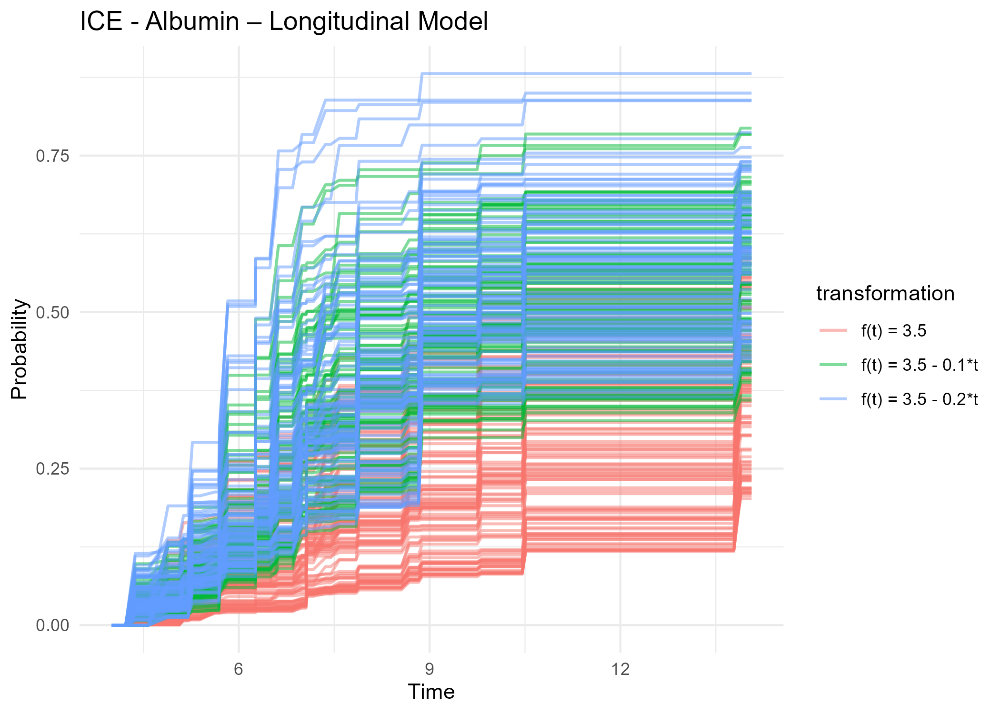
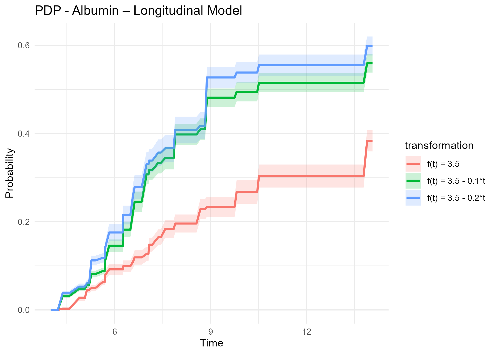
```

## Test 2 – serBilir – Clinical scenarios

```r
f1 <- function(t) rep(2, length(t))
f2 <- function(t) ifelse(t <= 2, 2, 3 * t - 4)
f3 <- function(t) ifelse(t <= 4, 2, 3 * t - 10)
f4 <- function(t) ifelse(t <= 6, 2, 3 * t - 16)
funcs <- list("f(t) = 2" = f1, "Increase at year 2" = f2, "Increase at year 4" = f3, "Increase at year 6" = f4)
res <- compute_ice_pdp(
  timeData = timeData_train, fixedData = fixedData_train, model = res_dyn,
  var_name = "serBilir", var_type = "longitudinal", values = funcs,
  timeVar = "time", idVar = "id", t0 = NULL
)
plot(res, x_label = "Time", title = "serBilir – Clinical scenarios", conf_band = FALSE, type = "both")
```

```{r, echo=FALSE, out.width="49%", fig.show='hold'}
knitr::include_graphics("plots_ice_pdp/serBilir_clinical_scenarios_ICE.png")
knitr::include_graphics("plots_ice_pdp/serBilir_clinical_scenarios_PDP.png")
```

## Test 3 – Age (5 quantiles)

```r
res <- compute_ice_pdp(
  timeData = timeData_train, fixedData = fixedData_train, model = res_dyn,
  var_name = "age", var_type = "numeric", values = 5,
  idVar = "id", timeVar = "time"
)
plot(res, x_label = "Time", title = "Age – 5 quantiles", conf_band = TRUE, type = "both")
```

```{r, echo=FALSE, out.width="49%", fig.show='hold'}
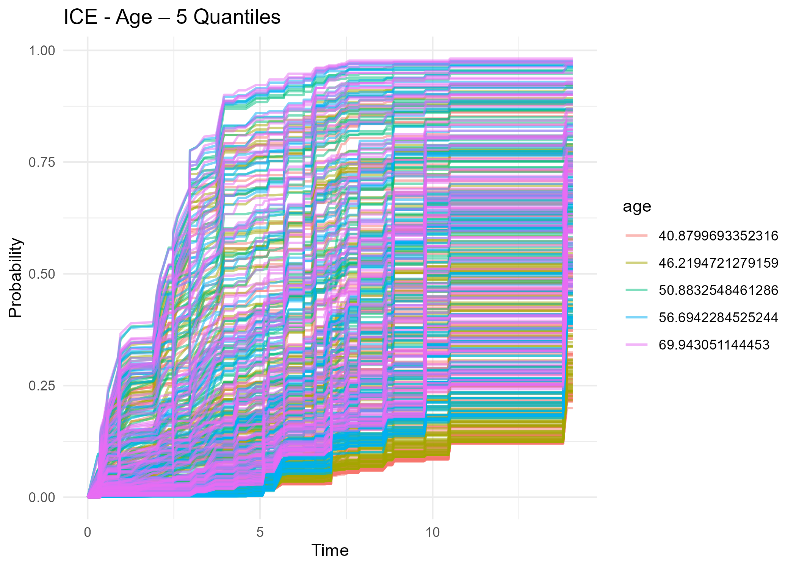
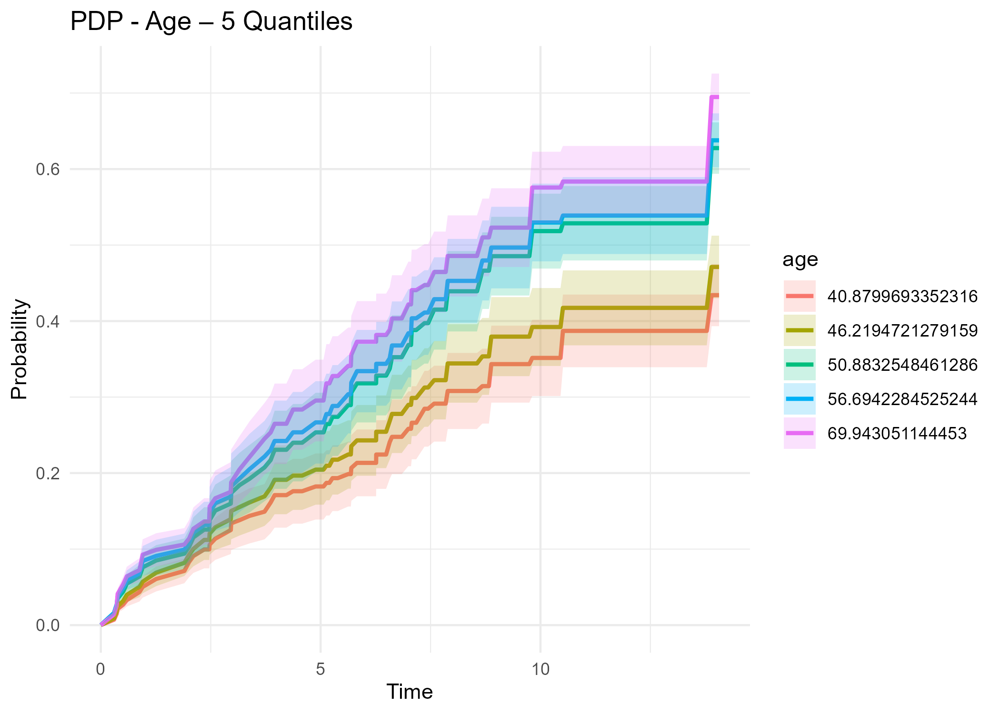
```

## Test 4 – Age: 30 vs 70 years

```r
res <- compute_ice_pdp(
  timeData = timeData_train, fixedData = fixedData_train, model = res_dyn,
  var_name = "age", var_type = "numeric", values = c(30, 70),
  idVar = "id", timeVar = "time"
)
plot(res, x_label = "Time", title = "Age – 30 vs 70 years", conf_band = FALSE, type = "both")
```

```{r, echo=FALSE,out.width="49%", fig.show='hold'}
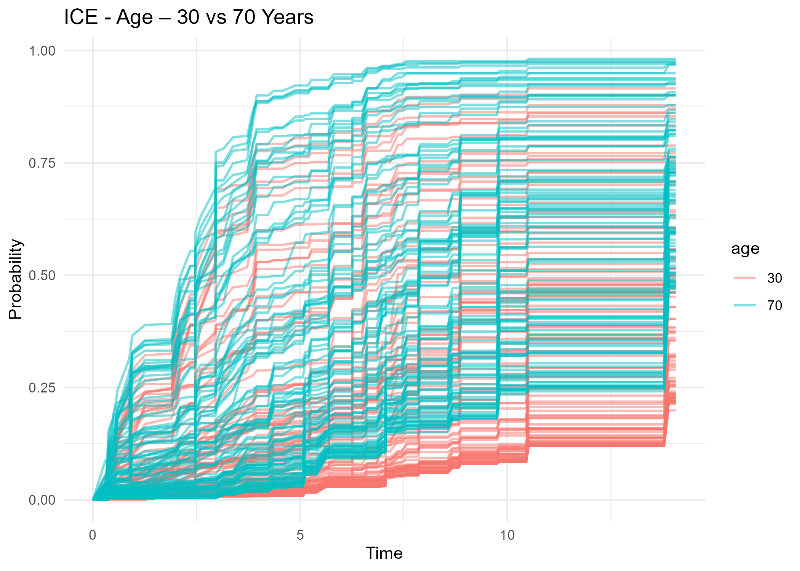
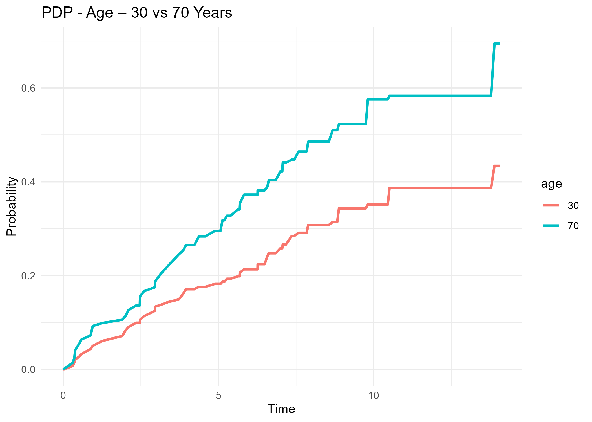
```

## Test 5 – Treatment (drug)

```r
res <- compute_ice_pdp(
  fixedData = fixedData_train, timeData = timeData_train, timeVar = "time",
  model = res_dyn, var_name = "drug", var_type = "categorical", idVar = "id",
  t0 =4
)
plot(res, x_label = "Time", title = "Treatment – Drug", conf_band = FALSE, type = "both")
```

```{r, echo=FALSE, out.width="49%", fig.show='hold'}
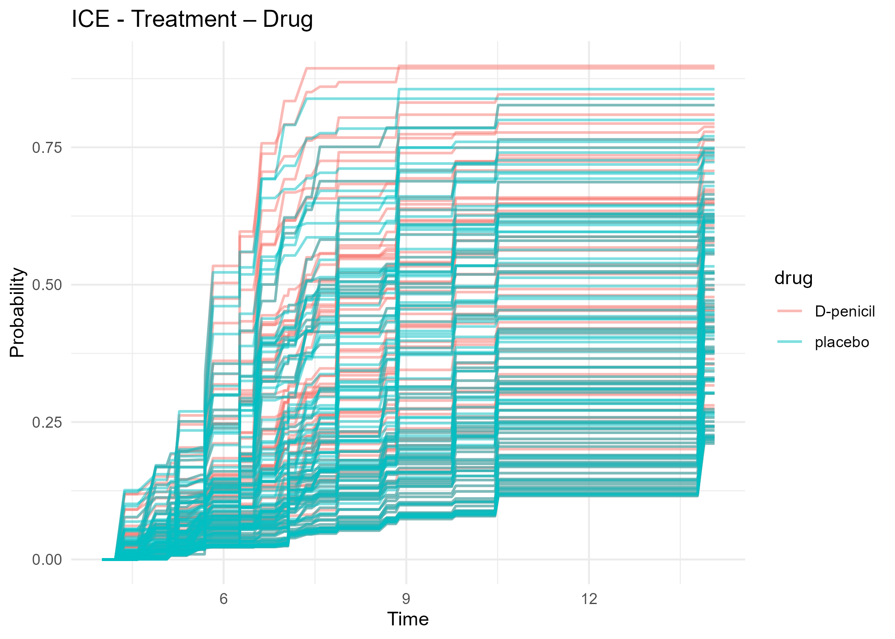
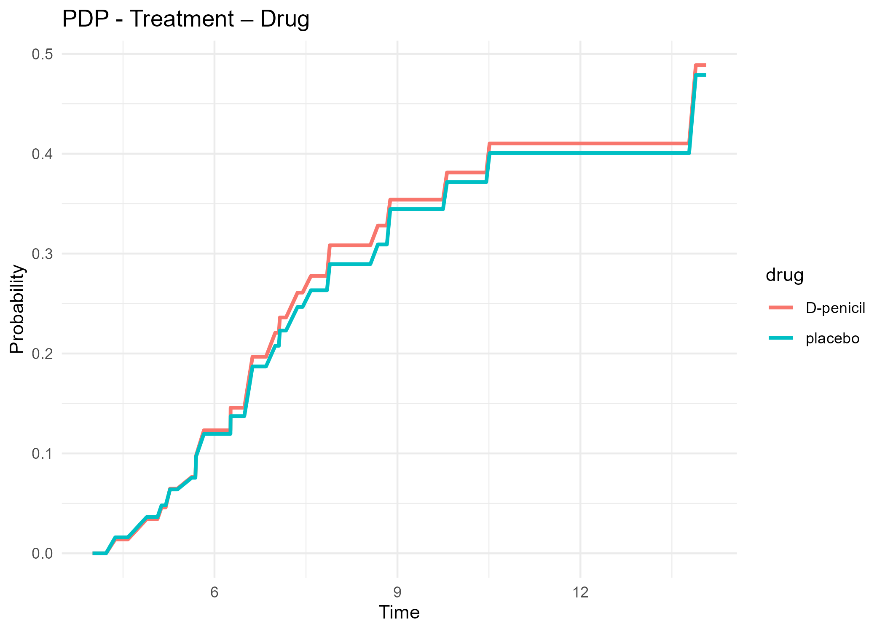
```

## Test 6 – Baseline – Age (5 quantiles)

```r
res <- compute_ice_pdp(
  fixedData = fixedData_baseline, model = res_dyn_baseline,
  var_name = "age", var_type = "numeric", values = 5, idVar = "id"
)
plot(res, title = "Baseline – Age (5 quantiles)", conf_band = TRUE, type = "both")
```

```{r, echo=FALSE, out.width="49%", fig.show='hold'}
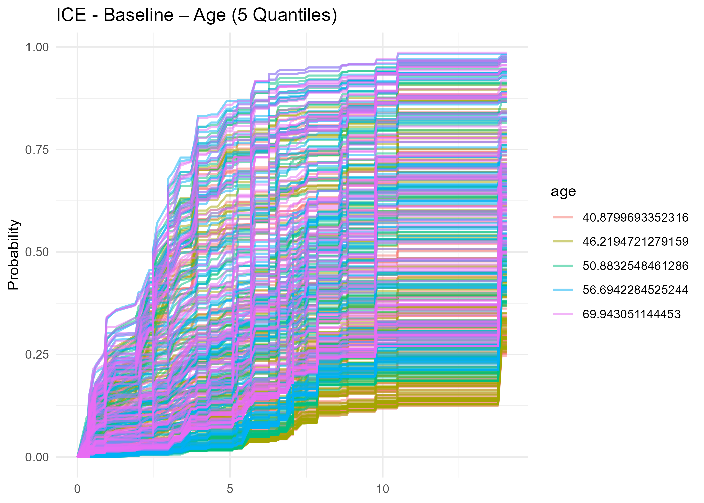
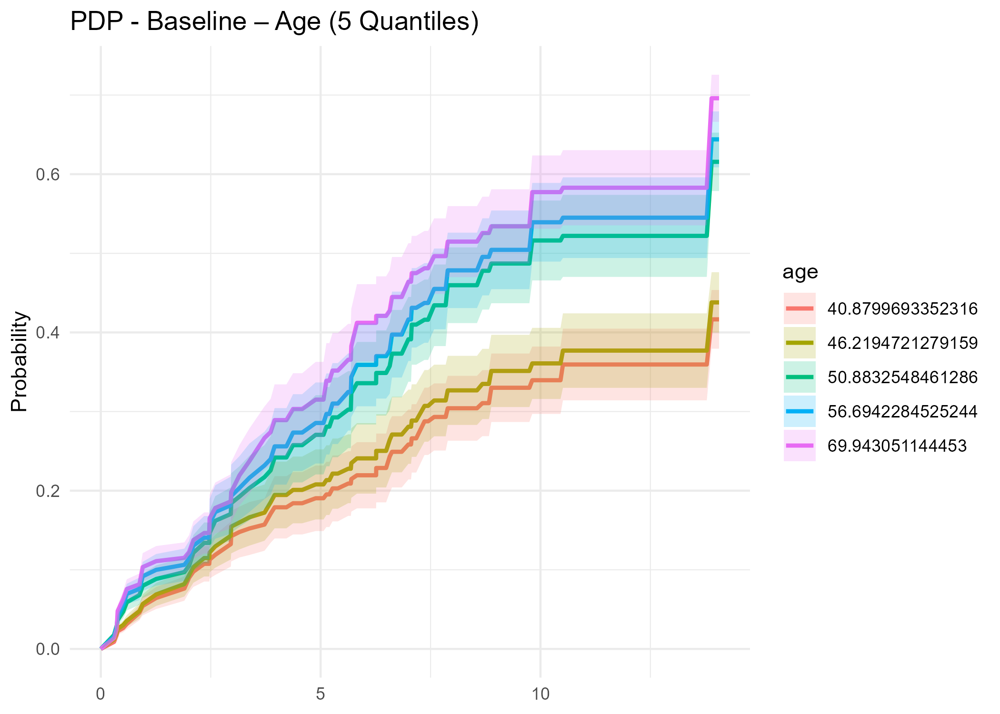
```

## Test 7 – Baseline – Albumin

```r
res <- compute_ice_pdp(
  fixedData = fixedData_baseline, model = res_dyn_baseline,
  var_name = "albumin", var_type = "numeric", values = 4, idVar = "id"
)
plot(res, title = "Baseline – Albumin", conf_band = FALSE, type = "both")
```

```{r, echo=FALSE, out.width="49%", fig.show='hold'}
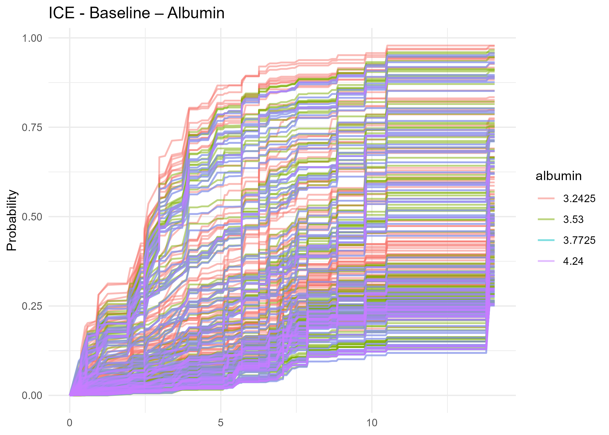
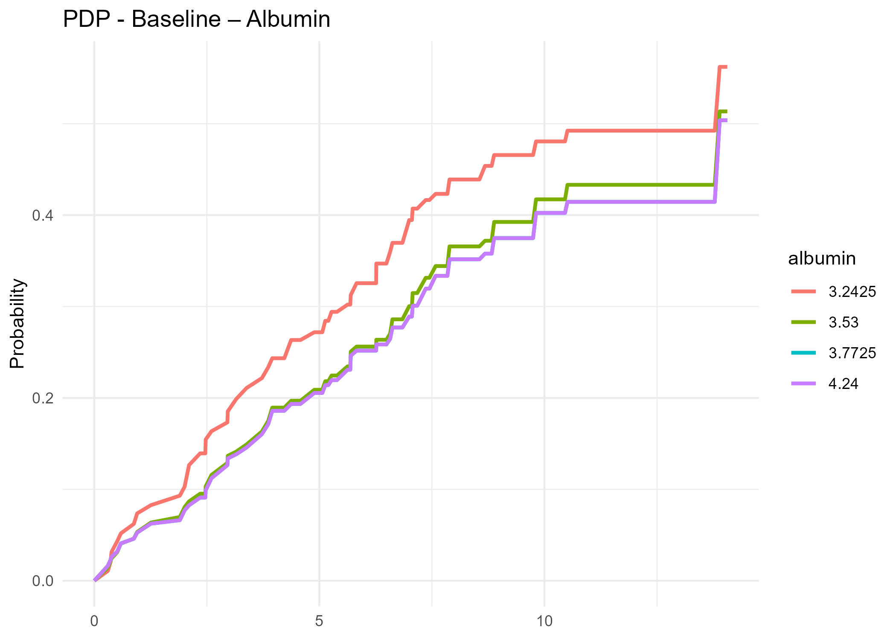
```

## Test 8 – MMM – serBilir_min (3 quantiles)

```r
res <- compute_ice_pdp(
  fixedData = fixedData_mmm, model = res_dyn_mmm,
  var_name = "serBilir_min", var_type = "numeric", values = 3, idVar = "id"
)
plot(res, title = "MMM – serBilir_min (3 quantiles)", conf_band = TRUE, type = "both")
```

```{r, echo=FALSE, out.width="49%", fig.show='hold'}
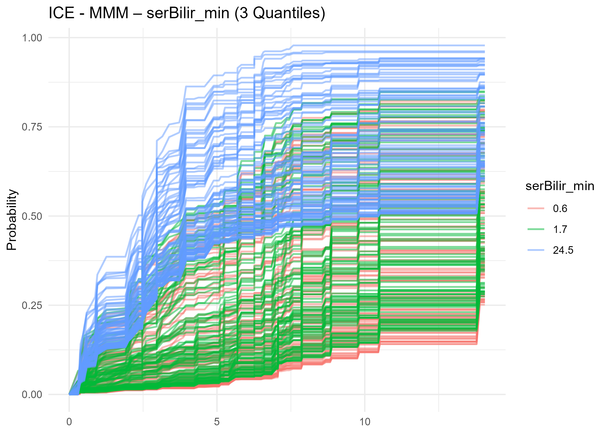
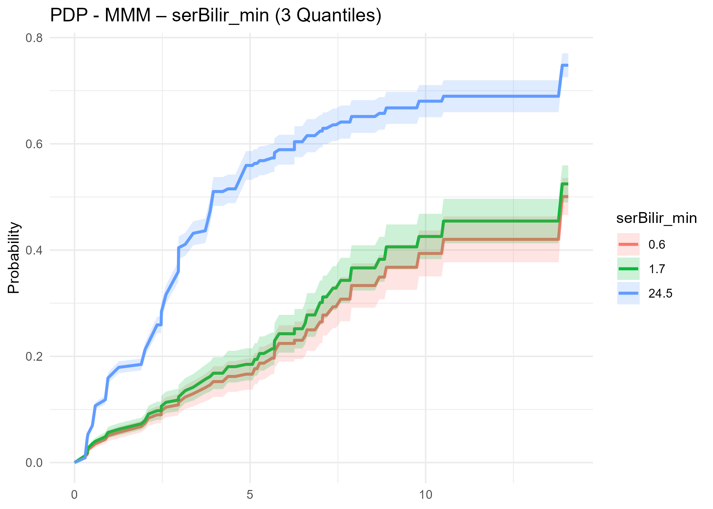
```

## Test 9 – MMM – serBilir_min (7 quantiles)

```r
res <- compute_ice_pdp(
  fixedData = fixedData_mmm, model = res_dyn_mmm,
  var_name = "serBilir_min", var_type = "numeric", values = 7, idVar = "id"
)
plot(res, title = "MMM – serBilir_min (7 quantiles)", conf_band = FALSE, type = "both")
```

```{r, echo=FALSE, out.width="49%", fig.show='hold'}
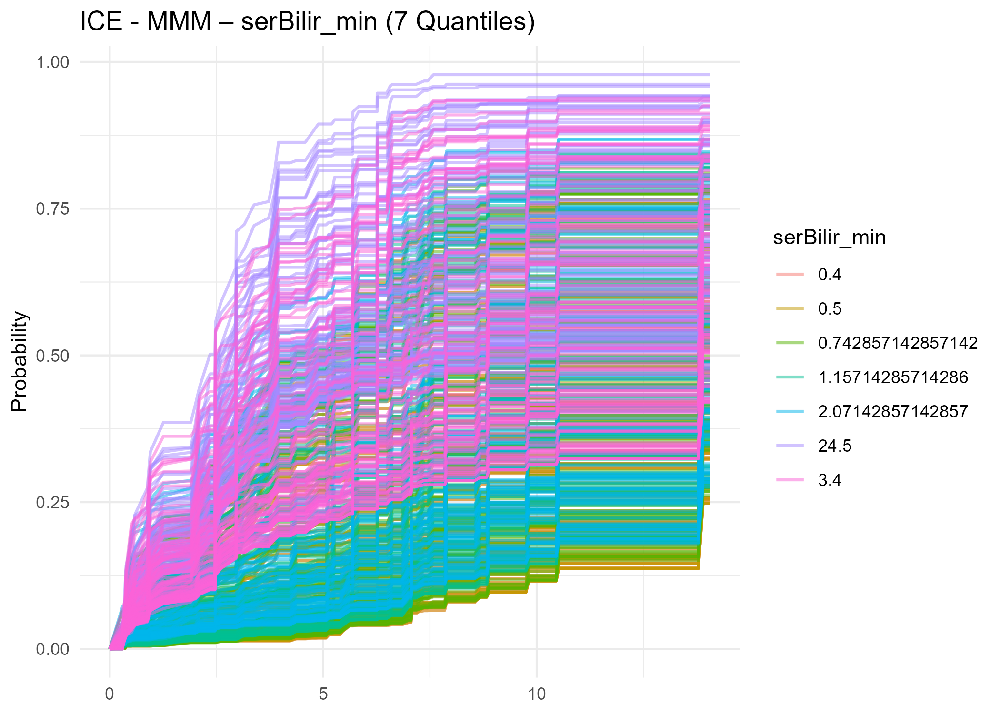
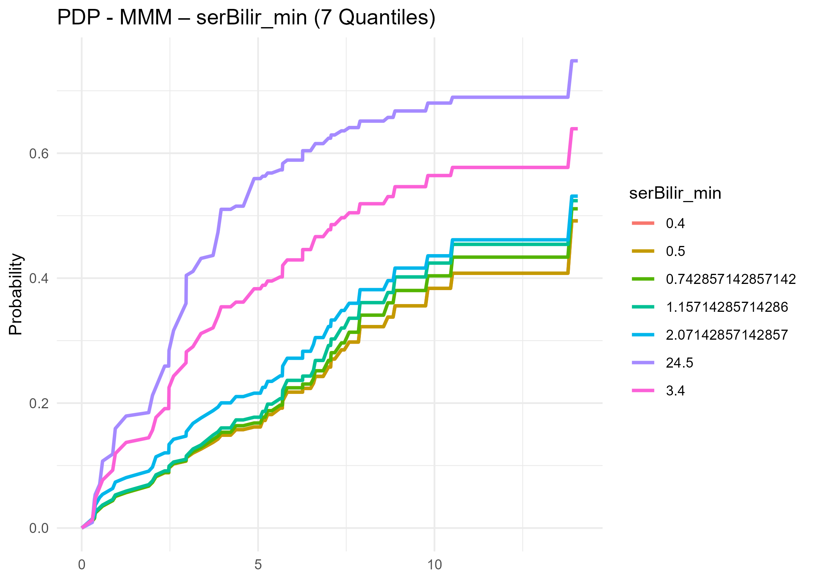
```
